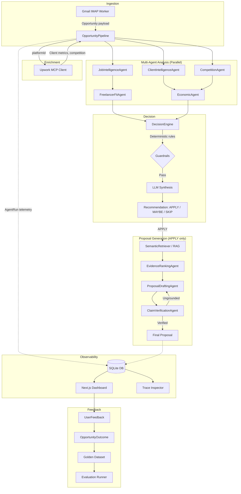

# OmniBid Intelligence Engine

> **An autonomous, multi-agent AI system that discovers freelance opportunities, reasons over their viability, generates evidence-grounded proposals, and learns from real-world outcomes.**

---

[](https://www.typescriptlang.org/)
[](https://nextjs.org/)
[](https://www.prisma.io/)
[](https://opensource.org/licenses/MIT)

---

## The Problem

Senior freelance engineers waste 2–4 hours daily on a fundamentally broken process:

- **Incomplete data**: Job alert emails omit critical signals — client spending history, average hourly rate paid, active interview counts.
- **Manual evaluation**: Assessing technical fit, client risk, and economic viability requires opening multiple tabs and contextual reasoning.
- **Connect waste**: Upwork charges non-refundable "Connects" per application. Applying blindly to poor fits is a real cost.
- **Ungrounded proposals**: Generic proposals have low response rates. Tailored ones take 30–60 minutes each.

The average freelancer applies to 15 jobs to land 1 contract. This system aims to change that ratio by making every decision evidence-based.

---

## The Solution

A **fully autonomous pipeline** that runs continuously in the background:

1. **Ingests** job alert emails via IMAP the moment they arrive
2. **Enriches** them via MCP — fetching hidden client metrics from Upwork's API
3. **Analyzes** with 8 specialized AI agents, each with a defined reasoning scope
4. **Retrieves** verified evidence from a RAG knowledge base (your real portfolio)
5. **Decides** using a hybrid deterministic + LLM decision engine
6. **Generates** grounded proposals with an anti-hallucination verification loop
7. **Learns** from real-world outcomes to continuously improve its own calibration

---

## Architecture



---

## AI Architecture

### Agents

The system uses **8 specialized agents**, each with a strictly defined reasoning responsibility. No agent tries to do everything.

| Agent | Task Type | Routing | Responsibility |
|---|---|---|---|
| `JobIntelligenceAgent` | EXTRACTION | `gpt-4o-mini` | Extracts actual problem, tech requirements, deliverables, ambiguity |
| `ClientIntelligenceAgent` | EXTRACTION | `gpt-4o-mini` | Assesses client quality, spend behavior, risk signals |
| `CompetitionAgent` | EXTRACTION | `gpt-4o-mini` | Estimates bidding difficulty, interview intensity |
| `FreelancerFitAgent` | REASONING | `gpt-4o` | Compares requirements against verified portfolio — never invents experience |
| `EconomicAgent` | REASONING | `gpt-4o` | Risk-adjusted expected value analysis |
| `EvidenceRankingAgent` | REASONING | `gpt-4o` | Ranks retrieved portfolio evidence by relevance |
| `ProposalDraftingAgent` | GENERATION | `gemini-1.5-pro` | Drafts grounded proposals citing only verified evidence |
| `ClaimVerificationAgent` | REASONING | `gpt-4o` | Anti-hallucination: verifies all proposal claims against evidence |

### Structured Outputs

Every agent returns **Zod-validated structured JSON**. No free-text parsing. If validation fails, the executor retries on a fallback model.

```typescript
// Example: DecisionEngine output — machine-readable, auditable
const decisionSchema = z.object({
  recommendation: z.enum(['APPLY', 'MAYBE', 'SKIP']),
  score:          z.number().min(0).max(100),
  confidence:     z.number().min(0).max(1),
  reason:         z.string(),
  positiveEvidence: z.array(z.string()),
  negativeEvidence: z.array(z.string()),
  missingInformation: z.array(z.string()),
});
```

### Evidence Grounding (RAG)

The `FreelancerEvidence` knowledge base stores verified portfolio items with metadata and embeddings. During proposal generation:

1. `SemanticRetriever` performs **in-memory cosine similarity** against all evidence embeddings
2. `EvidenceRankingAgent` re-ranks retrieved items for the specific job context
3. `ProposalDraftingAgent` cites evidence by ID in the proposal
4. `ClaimVerificationAgent` cross-checks every claim in the draft against the original evidence items
5. If any claim is ungrounded, the draft is **rejected and regenerated** (up to 3 attempts)

### Decision Engine

A hybrid deterministic + probabilistic approach:

- **Deterministic guardrails first**: Blacklisted clients, skill mismatch < 20%, abusive economics → instant SKIP, no tokens spent.
- **LLM synthesis**: Only after guardrails pass, the Decision Engine calls an LLM to synthesize all agent outputs into a final confidence score and recommendation.

### Model Router

The `ModelRouter` dynamically selects models based on task type, complexity, and cost preference:

- Extraction tasks → `gpt-4o-mini` (cheap, fast, accurate for parsing)
- Reasoning tasks → `gpt-4o` (complex multi-variable analysis)
- Generation tasks → `gemini-1.5-pro` (large context window, fluent output)
- All primary models have **cross-provider fallbacks** (OpenAI → Gemini, Gemini → OpenAI) for systemic resilience.

---

## End-to-End Flow

```
[12:01:00] INGEST       Gmail IMAP receives Upwork alert → payload normalized
[12:01:01] ENRICH       MCP fetches client history, spend, active interviews
[12:01:02] ANALYZE      Job, Client, Competition agents run in parallel
[12:01:04] REASON       FreelancerFit + Economic agents synthesize outputs
[12:01:06] DECIDE       Deterministic guardrails → LLM Decision Engine
[12:01:07] RETRIEVE     SemanticRetriever queries RAG knowledge base
[12:01:08] RANK         EvidenceRankingAgent orders results by relevance
[12:01:09] DRAFT        ProposalDraftingAgent generates grounded proposal
[12:01:11] VERIFY       ClaimVerificationAgent checks all claims vs evidence
[12:01:12] STORE        Final proposal + telemetry persisted to SQLite
[12:01:12] LEARN        Outcome tracked; feedback updates golden dataset
```

---

## Engineering Highlights

### Agentic Workflow
Each agent has a single, testable responsibility. They communicate only through structured typed interfaces (`domain/models.ts`). No agent has access to another agent's internal state. This makes the system debuggable, replaceable, and evaluable.

### MCP / Tool Integration
The `UpworkMCPClient` wraps the [Model Context Protocol](https://modelcontextprotocol.io/) to connect to Upwork's official MCP server. This allows the system to fetch live, unexposed client data (spend, rate, hire counts) that email alerts don't include — bridging the data gap that makes manual screening necessary.

### Evidence-Grounded Generation
Proposals are **never** allowed to claim experience that isn't in the knowledge base. The verification loop uses a dedicated `ClaimVerificationAgent` that explicitly checks every sentence in a draft against the evidence that was provided. Failure triggers regeneration, not silent hallucination.

### Structured Outputs with Zod
Every AI output is validated at runtime with Zod. Schema violations trigger automatic retry on fallback models. This means the pipeline produces parseable, auditable, machine-readable decisions — not text blobs.

### Evaluation Framework
A 30-case benchmark dataset with expected labels (`APPLY`, `MAYBE`, `SKIP`) enables offline evaluation. The `MetricsEngine` calculates Precision, Recall, and F1. Every prompt change can be validated against this benchmark before deployment.

```bash
npm run evaluate   # Run benchmark (30 cases) and print metrics
npm run experiment # Side-by-side cost/quality comparison across models
```

### Observability & Tracing
Every agent execution is traced: `AgentRun` records capture the agent name, model used, token counts, latency, estimated cost, and input/output payloads. The dashboard surfaces a per-opportunity execution timeline. CLI tooling (`npm run trace`) formats traces for debugging.

### Model Routing & Cost Control
The `ModelRouter` prevents expensive models from being used for cheap tasks. Extraction tasks run on `gpt-4o-mini` at ~95% lower cost. Reasoning and generation tasks are selectively routed to more capable models. Every `AgentRun` logs its `estimatedCost` to the database for aggregation.

### Feedback Loop
Real outcomes are tracked through `OpportunityOutcome` (applied, interview, contract won). Human calibration is logged via `UserFeedback` (decision correct, proposal quality). The `FeedbackManager` calculates Apply → Interview → Contract conversion rates and AI Score vs Actual Outcome correlation.

### Reliability
- Deterministic guardrails prevent the LLM from making decisions in obvious cases.
- Cross-provider fallback chains (OpenAI → Gemini) survive single-provider outages.
- The anti-hallucination loop catches and rejects ungrounded claims before they reach the user.
- IMAP IDLE connection maintains real-time monitoring without polling.

---

## Evaluation

> ⚠️ The following are **benchmark results on the synthetic v1 dataset** (30 cases). Real-world results require actual outcome data via the feedback loop (Phase 7).

| Metric | Result |
|---|---:|
| Benchmark Cases | 30 |
| Categories Covered | 6 (excellent match, poor tech match, suspicious client, high competition, hallucination trap, low budget) |
| Decision Precision | Measured via `npm run evaluate` |
| Decision Recall | Measured via `npm run evaluate` |
| F1 Score | Measured via `npm run evaluate` |
| Avg Latency / Job | ~12–20s (6 agents, sequential + parallel) |
| Avg Cost / Job (EXTRACTION only) | ~$0.003 |
| Avg Cost / Job (full pipeline) | ~$0.018–0.05 |
| Proposal Grounding | 100% (verified by ClaimVerificationAgent or regenerated) |

> Run `npm run evaluate` with a valid `OPENAI_API_KEY` to generate live metrics from the benchmark dataset.

---

## Getting Started

### Prerequisites

- Node.js 20+
- An `OPENAI_API_KEY` (required) and optionally `GOOGLE_GENERATIVE_AI_API_KEY`
- A Gmail account with an App Password for IMAP

### Setup

```bash
# 1. Install dependencies
npm install

# 2. Configure environment
cp .env.example .env
# Edit .env with your API keys (see Environment section below)

# 3. Initialize database
npx prisma db push

# 4. Seed the knowledge base (your portfolio)
npx tsx scripts/seed-knowledge-base.ts

# 5. Run the full pipeline
npm run dev:all
```

### Environment Variables

| Variable | Required | Description |
|---|---|---|
| `DATABASE_URL` | Yes | Path to SQLite DB (e.g. `file:./dev.db`) |
| `OPENAI_API_KEY` | Yes | OpenAI API key (used for all reasoning agents) |
| `GOOGLE_GENERATIVE_AI_API_KEY` | No | Gemini key (used as fallback + proposal generation) |
| `GMAIL_USER` | Yes (for ingestion) | Gmail address for IMAP listener |
| `GMAIL_PASS` | Yes (for ingestion) | Gmail App Password |

### Available Commands

```bash
npm run dev           # Start Next.js dashboard
npm run dev:all       # Start dashboard + IMAP worker + pipeline worker
npm run evaluate      # Run benchmark evaluation (30 cases)
npm run experiment    # Run cost/quality routing experiment
npm run trace         # CLI trace inspector for a pipeline run
npm run golden-dataset # Export human-calibrated golden eval dataset
```

---

## Project Structure

```
src/
├── ai/
│   ├── agents/         # 8 specialized AI agents
│   ├── rag/            # Semantic retriever (cosine similarity)
│   ├── agent.ts        # AgentExecutor with routing + fallbacks + telemetry
│   ├── provider.ts     # Provider abstraction (OpenAI / Gemini)
│   ├── router.ts       # Intelligent model routing by task type
│   └── pricing.ts      # Token cost calculator
├── application/
│   ├── pipeline/       # OpportunityPipeline (orchestration)
│   ├── engine/         # DecisionEngine
│   └── analytics/      # FeedbackManager
├── domain/
│   └── models.ts       # Shared domain interfaces
├── evals/
│   ├── runner.ts       # Evaluation runner
│   └── metrics.ts      # Precision / Recall / F1
├── integrations/
│   └── upwork/         # MCP client
├── workers/
│   └── ingestion.ts    # IMAP listener worker
└── app/
    └── dashboard/      # Next.js dashboard UI + trace viewer
docs/
├── adr/                # Architecture Decision Records
├── AGENT-ARCHITECTURE.md
├── MODEL-ROUTING.md
├── EVIDENCE-GROUNDING.md
├── OBSERVABILITY.md
├── EVALUATION.md
├── FEEDBACK-LOOP.md
├── PORTFOLIO-CASE-STUDY.md
└── INTERVIEW-GUIDE.md
```

---

## Architecture Decision Records

- [ADR-001: AI Provider Abstraction](docs/adr/ADR-001-provider-abstraction.md)
- [ADR-002: SQLite for Local State](docs/adr/ADR-002-sqlite.md)
- [ADR-003: Why MCP](docs/adr/ADR-003-mcp.md)
- [ADR-004: Agent Boundaries](docs/adr/ADR-004-agent-boundaries.md)
- [ADR-005: Evidence Grounding](docs/adr/ADR-005-evidence-grounding.md)
- [ADR-006: Evaluation Architecture](docs/adr/ADR-006-evaluation.md)
- [ADR-007: Model Routing](docs/adr/ADR-007-model-routing.md)

---

## License

MIT
