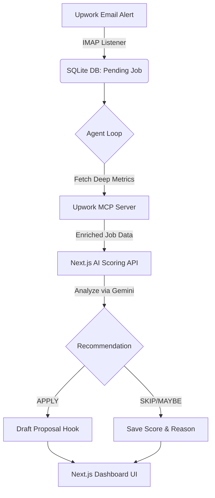

# 🚀 AI-Powered Upwork Opportunity Analyzer & Automation Engine

> **An autonomous, multi-agent pipeline that ingests job alerts, extracts hidden client metrics via MCP, and uses AI to evaluate opportunities and draft hyper-personalized proposals.**

---

## 🎯 The Problem

Finding high-quality freelance work on Upwork is a highly inefficient process:
- **Data Asymmetry**: Standard email alerts lack critical information (client history, average hourly rate paid, total spend).
- **Time Sink**: Engineers spend hours manually sifting through low-quality jobs and filtering out "bad actors."
- **Connect Waste**: Applying to jobs with poor economics or massive competition wastes expensive Connects.
- **Generic Proposals**: Manually writing tailored proposals for every job is slow and draining.

## 💡 The Solution

This platform is a **fully autonomous job screening engine**. It replaces manual browsing with a background processing pipeline that scores jobs on technical fit, uncovers hidden client metrics, and drafts the hardest part of the proposal: the hook.

By integrating **Google Gemini**, **Next.js**, and the bleeding-edge **Model Context Protocol (MCP)**, this tool ensures you only spend time on high-probability, high-value opportunities.

---

## ✨ Key Technical Features

### 1. 📧 Real-Time IMAP Ingestion
A robust, background Node.js worker (`imapflow`) that maintains an IDLE connection to Gmail, instantly intercepting Upwork job alerts the second they arrive and queueing them in a local SQLite database for processing.

### 2. 🕵️ Hidden Metric Extraction via MCP (Model Context Protocol)
Email alerts don't tell the whole story. The Agent Loop connects to an **Upwork MCP Server** to programmatically fetch deep, unexposed client metrics:
- Total Historical Spend
- Average Hourly Rate Paid
- Active Competition (Freelancers currently interviewing)
- Client Feedback Scores

### 3. 🧠 AI-Driven Decision Engine (Vercel AI SDK + Gemini)
Using `generateObject` from the Vercel AI SDK, the platform feeds the enriched job data to **Google Gemini 3.6 Flash**. The AI is constrained by a strict, hardcoded "Freelancer Profile" containing only verified past projects and metrics. It analyzes:
- Technical and seniority fit.
- Red flags and missing requirements.
- Budget economics and long-term potential.
It then outputs a deterministic recommendation (`APPLY`, `MAYBE`, `SKIP`) and a `skillMatch` score (0-100).

### 4. ✍️ Context-Aware Proposal Drafting
If the AI recommends `APPLY`, it automatically generates a highly targeted, 2-sentence proposal hook. 
- **Sentence 1**: Demonstrates deep understanding of the client's specific problem.
- **Sentence 2**: Connects that problem to a *verified* metric from the freelancer's portfolio (e.g., "At Dastgyr, I achieved a 50% reduction in API latency...").
- *Zero generic fluff, zero AI clichés.*

### 5. 🛡️ Client Memory & Reputation System
The system maintains a relational database of clients. If a client is marked as `BLACKLISTED`, the system instantly rejects their future jobs without wasting API tokens. If marked `FAVORITE`, the AI is instructed to aggressively boost the opportunity score.

---

## 🏗️ Architecture & Flow



## 💻 Tech Stack

- **Framework**: Next.js 15 (App Router), React 19
- **Language**: TypeScript
- **Database / ORM**: Prisma + SQLite (Better-SQLite3)
- **AI & Orchestration**: Vercel AI SDK (`ai`, `@ai-sdk/google`), Google Gemini 3.6 Flash
- **System Integration**: Model Context Protocol (`@modelcontextprotocol/sdk`)
- **Background Workers**: Node.js, ImapFlow, Mailparser, Concurrently
- **UI / Styling**: Tailwind CSS v4, Shadcn UI, Lucide Icons

---

## 👨‍💻 Note to CTOs and Recruiters

This project was built to demonstrate a deep understanding of modern software architecture, AI orchestration, and real-world problem-solving. It highlights several key engineering competencies:

1. **Agentic Workflows**: Moving beyond simple chat interfaces to background, autonomous AI agents that perform multi-step reasoning.
2. **Data Enrichment**: Leveraging MCP to bridge the gap between simple triggers (emails) and complex decision-making data.
3. **Prompt Engineering & Constrained Output**: Forcing LLMs to return strictly typed JSON (`zod`) based on strict rules (no hallucinating experience, no generic fluff).
4. **Full-Stack Execution**: Handling everything from low-level network protocols (IMAP) to background polling, relational database modeling, and building a responsive frontend dashboard.

This isn't a toy app—it's a high-ROI automation tool built to optimize time and resources.

---

## 🚀 Getting Started

1. Clone the repository and install dependencies:
   ```bash
   npm install
   ```
2. Configure your `.env` file (Gmail App Password, Database URL, Google AI API Key).
3. Initialize the database:
   ```bash
   npx prisma db push
   ```
4. Start the entire pipeline (Frontend + IMAP Listener + Agent Loop):
   ```bash
   npm run dev:all
   ```
5. View the dashboard at [http://localhost:3000](http://localhost:3000).
