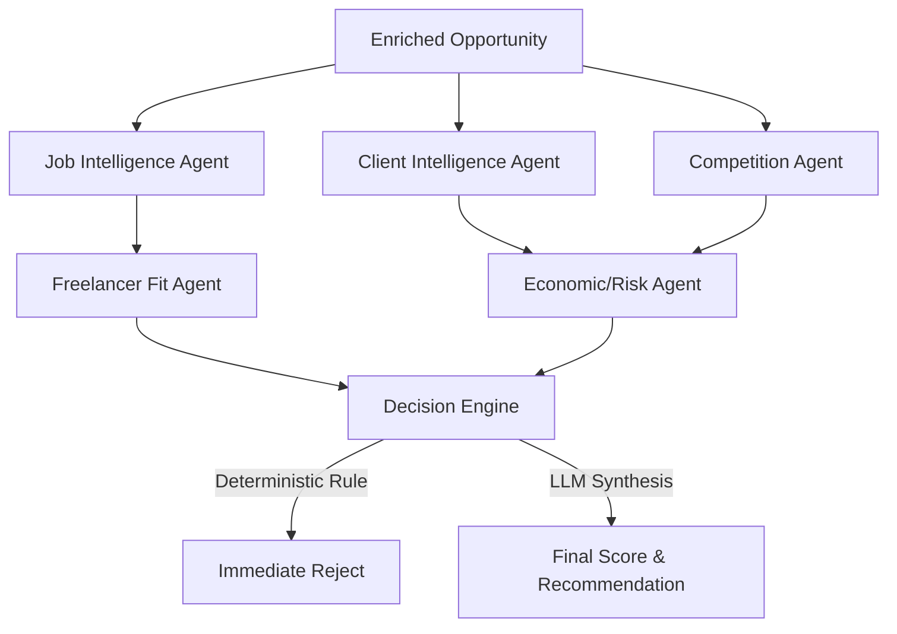

# Multi-Agent Opportunity Analysis Architecture

This document describes the Phase 2 agentic workflow for analyzing freelance opportunities. Rather than relying on a single monolithic prompt, we decompose the reasoning into specialized, purpose-built agents.

## Architecture Diagram

## Agent Responsibilities & Justifications

### 1. Job Intelligence Agent
- **Purpose**: Extracts the core problem, technical requirements, deliverables, and ambiguity from raw job descriptions.
- **Why it exists**: Raw job descriptions are unstructured and often bury the actual requirements. A specialized agent ensures downstream agents (like Freelancer Fit) only work with normalized, explicit signals.

### 2. Client Intelligence Agent
- **Purpose**: Assesses client quality, spending behavior, and risk signals based on their Upwork history.
- **Why it exists**: Prevents wasting time on clients with a history of non-payment, poor feedback, or unusually low hourly rates.

### 3. Competition Agent
- **Purpose**: Estimates the difficulty of winning the job based on interview counts, invites sent, and average bids.
- **Why it exists**: An opportunity is only as good as the probability of winning it. High competition requires higher effort.

### 4. Freelancer Fit Agent
- **Purpose**: Compares the Job Intelligence output against the verified freelancer portfolio.
- **Why it exists**: Ensures we only apply to jobs where we have a demonstrably strong chance of success. 
- **Hallucination Control**: The prompt explicitly enforces a rule to NEVER invent experience, and it is structured to only output "evidence-backed matches" based on a static (or RAG-retrieved) portfolio profile.

### 5. Economic/Risk Agent
- **Purpose**: Synthesizes the budget, client quality, and competition into a risk-adjusted expected value.
- **Why it exists**: Prevents taking on high-risk, low-reward projects even if the technical fit is perfect.

## Decision Engine & Deterministic Rules

The **Decision Engine** acts as the final orchestrator. Before invoking any LLM, it applies deterministic guardrails:
- **Blacklists**: If the client is known to be a scammer or has severe risk signals, it rejects immediately.
- **Skill Mismatches**: If the fit score is abysmally low (< 20%), it rejects.
- **Terrible Economics**: If the budget is low and client risk is high, it rejects.

**Why keep deterministic logic?**
LLMs are probabilistic and susceptible to prompt injection or poor reasoning under edge cases. Deterministic rules act as hard safety rails. We do not want an LLM to decide if it should apply for a job when a client explicitly says "no payment until completion" — that is an automatic rejection.

## Hallucination Control & Structured Outputs
Every agent outputs strictly validated data using **Zod schemas**. By forcing the models to return structured JSON (e.g., boolean flags, enums, specific numeric bounds), we drastically reduce the chance of the model wandering off-topic or returning unparseable text.

Furthermore, by breaking the pipeline into specialized agents, we reduce the cognitive load on any single prompt, which improves accuracy and adherence to instructions.
