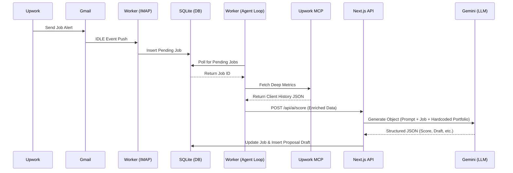

# Deep Repository Audit: AI Freelance Pipeline

## 1. Current Architecture
The current system is a rudimentary automated pipeline consisting of three main loosely-coupled components running concurrently on a single machine:
- **IMAP Listener** (`src/worker/imapListener.ts`): A persistent Node.js worker using `imapflow` to maintain an IDLE connection to a Gmail account. It intercepts Upwork email alerts, parses the job ID, and persists a pending `Job` record in a local SQLite database.
- **Agent Loop** (`src/worker/agentLoop.ts`): A crude polling worker that continuously checks the SQLite database for pending jobs. When found, it initializes an Upwork MCP server connection via standard I/O, fetches deep client metrics programmatically, upserts a `Client` record, and makes an HTTP POST request to the local Next.js API.
- **Next.js Web & API** (`src/app/`): Serves as both the frontend dashboard (fetching directly from SQLite) and the AI orchestration layer (`/api/ai/score`). The API route utilizes the Vercel AI SDK to call Google Gemini, passing a heavily hardcoded prompt template, and saves the structured output back to the database.

## 2. Current Data Flow


## 3. Current AI Flow
AI processing occurs entirely within the Next.js API route (`src/app/api/ai/score/route.ts`).
- **Trigger**: The Agent Loop POSTs enriched job data.
- **Context Injection**: The system uses a large, static string template incorporating the job data alongside a rigidly hardcoded "Freelancer Profile" and "Verified Experience." 
- **Generation**: It uses the Vercel AI SDK's `generateObject` bounded by a Zod schema to enforce structured output.
- **Decision Logic**: The LLM simultaneously determines technical fit, flags missing requirements, assigns a score (0-100), outputs a recommendation (`APPLY`, `MAYBE`, `SKIP`), and drafts a two-sentence proposal hook.
- **Persistence**: Only a subset of the generated data (score, reason, recommendation, draft) is saved back to the database. The rich reasoning (missing requirements, red flags, recommended projects) is currently discarded.

## 4. Architectural Weaknesses

### Critical
- **State Management & Concurrency:** Multi-process workers accessing SQLite simultaneously creates high risks for database locking (`SQLITE_BUSY`). Polling a database table for job state without a robust queue invites race conditions and missed updates.
- **API Abuse for Workers:** The background worker makes HTTP calls to the Next.js API for heavy LLM processing. This ties background processing to web server timeouts (Next.js serverless functions have timeouts) and mixes web concerns with backend worker concerns.
- **Hardcoded Configuration:** Crucial configurations like `ORG_UID` and the entire freelancer profile are hardcoded directly in the source code, destroying modularity.
- **Error Handling:** The `agentLoop.ts` catches errors but simply logs them and moves on. A failed MCP fetch or AI API timeout results in a job permanently stuck in a "Pending" state or partially processed.

### High
- **Lack of Idempotency:** If the Next.js API successfully calls Gemini but fails to write to SQLite, the worker might retry and trigger a duplicate, expensive LLM call.
- **Fragile Client ID Hashing:** If an Upwork job lacks a `company_id`, the system generates a pseudo-hash from country, total spend, and hires. This is highly collision-prone and brittle.
- **Monolithic Prompts:** Shoving scoring, drafting, and portfolio matching into a single LLM call dilutes attention. It limits the context window available for large job descriptions and increases hallucination risk for the draft.

### Medium
- **MCP Connection Lifecycle:** Spinning up a new `mcp-remote` stdio process per batch loop is computationally expensive.
- **No Transaction Boundaries:** Creating a client and updating a job are distinct Prisma calls in `agentLoop.ts` and `route.ts`. A crash mid-way leaves the database in an inconsistent state.

### Low
- **Frontend Architecture:** The Next.js dashboard is entirely static server-rendered on load. Real-time updates require manual refresh.
- **Testing:** Absolutely zero automated tests.

## 5. AI Engineering Gaps
- **Agent Orchestration:** The system is a linear script calling an LLM, not an agentic workflow. An agent should be able to dynamically decide *which* tools to use (e.g., if a job mentions a specific technology, it could use an MCP tool to search the freelancer's GitHub for related projects).
- **Retrieval & Memory (RAG):** The freelancer's portfolio is hardcoded. A production system should use embeddings and a vector store to dynamically retrieve only the most semantically relevant past projects based on the specific job description.
- **Tool Abstraction:** MCP is called manually via a hardcoded subprocess wrapper. It should be exposed as an actual `tool` to the LLM so the model can choose when and how to request deeper metrics.
- **Evaluation:** There is no mechanism to evaluate if the AI is making good decisions. We need a feedback loop (e.g., user clicks "Thumbs Up" on a recommendation) to adjust future prompts or fine-tune models.
- **Observability:** No AI tracing. If the LLM generates a bad draft, there is no way to inspect the trace (tokens, exact prompt, latency) without digging through console logs.
- **Structured Reasoning:** The LLM is forced to output a final schema without a dedicated "chain-of-thought" or scratchpad field, potentially degrading the reasoning quality.

## 6. Production Engineering Gaps
- **Reliability:** Missing a robust message broker (Redis/RabbitMQ/BullMQ). If the Node process dies, state is lost.
- **Retries & Backoff:** HTTP failures to Gemini or MCP lack exponential backoff strategies.
- **Configuration & Secrets Management:** Reliance on `.env` without validation or a secrets manager.
- **Observability:** Missing structured logging (e.g., Pino) and APM monitoring.
- **Transaction Boundaries:** Missing Prisma `$transaction` blocks for atomic operations.

## 7. Portfolio Weaknesses (The "Recruiter Perspective")
Currently, a technical recruiter or Senior AI Engineer reviewing this repository will perceive it as a **"Thin LLM Wrapper."**
Why? Because the core logic is essentially: `cron_job -> extract_text -> hardcoded_prompt -> Gemini_API -> SQL_UPDATE`.
It demonstrates scripting capability, but lacks the hallmarks of **Systems Engineering**. 
To be a top 1% AI Engineering portfolio piece, it must demonstrate:
1. **Separation of Concerns:** Workers should consume from a durable queue, not poll a database.
2. **Dynamic Context (RAG):** Context should be dynamically assembled via semantic search, not statically hardcoded.
3. **Agentic Autonomy:** The LLM should dictate tool usage, not just act as a text-to-JSON parser.
4. **Production Observability:** It must include tracing (Langfuse/LangSmith) to prove you understand that LLMs in production are non-deterministic and require monitoring.
5. **Evaluation Frameworks:** Proving you know how to measure LLM performance against a ground truth.

## 8. Target Architecture

```mermaid
graph TD
    subgraph Ingestion Layer
        A[Gmail IMAP] -->|Event| B(Worker: Listener)
    end
    
    subgraph Queue Layer (Redis/BullMQ)
        B -->|Enqueue Job| C{Job Queue}
        F -.->|Enqueue Eval| C
    end
    
    subgraph Agentic Worker Layer
        C -->|Pop Job| D[Orchestrator Agent]
        D <-->|Tool Call| E[Upwork MCP Server]
        D <-->|Semantic Search| V[Vector Store: Portfolio RAG]
        D <-->|LLM Call| L[Gemini / OpenAI]
    end
    
    subgraph Data & Observability
        D -->|Persist State| DB[(PostgreSQL)]
        D -->|Traces/Metrics| O[Langfuse / Phoenix]
    end
    
    subgraph User Interface (Next.js)
        DB <--> UI[Next.js App Router]
        UI -->|Human-in-the-Loop Feedback| F[Feedback API]
    end
```

## 9. Priority Matrix

| Priority | Initiative | Impact | Effort | Recruiter Value | AI Engineering Value |
|----------|------------|--------|--------|-----------------|----------------------|
| **P0** | **Database & Queue Migration** (PostgreSQL + BullMQ) | High | Medium | High (Sys Design) | Medium |
| **P1** | **Workflow Decoupling** (Move LLM out of API to Worker) | High | Low | Medium | High |
| **P2** | **Agentic Orchestration** (LangGraph or Vercel AI Agents) | High | High | Very High | Very High |
| **P3** | **Dynamic RAG** (Vectorize Portfolio & Semantic Retrieval) | Medium | Medium | High | Very High |
| **P4** | **Observability** (Langfuse/LangSmith Integration) | High | Low | High | Very High |
| **P5** | **Evaluation & Human-in-the-Loop Feedback** | Medium | Medium | Very High | Very High |

## 10. Implementation Roadmap

### Phase 1: Production Foundation (Backend Systems)
- Migrate SQLite to PostgreSQL (Neon or local Docker).
- Introduce Redis and BullMQ for robust background job processing.
- Refactor the Next.js API; shift LLM calls directly into the isolated BullMQ worker process.
- Implement proper transaction boundaries and error handling (exponential backoff).

### Phase 2: Agentic Transformation
- Deprecate the linear `agentLoop.ts`.
- Implement a true multi-step agent workflow (e.g., State Machine).
- Abstract the Upwork MCP into a callable tool that the Agent can autonomously invoke based on the job description.
- Split the monolithic prompt into distinct reasoning steps: (1) Data Extraction, (2) Scoring, (3) Drafting.

### Phase 3: Dynamic Context (RAG & Memory)
- Remove the hardcoded freelancer profile.
- Implement a local vector store or embedding pipeline for past successful proposals and portfolio projects.
- Inject relevant portfolio items dynamically during the Agent's reasoning phase.

### Phase 4: Observability & Evaluation
- Instrument all LLM calls with Langfuse or similar tracing tools.
- Build a Human-in-the-loop feedback mechanism in the Next.js UI (approve/reject AI recommendations).
- Create an offline evaluation script to test prompt changes against a dataset of past jobs.
