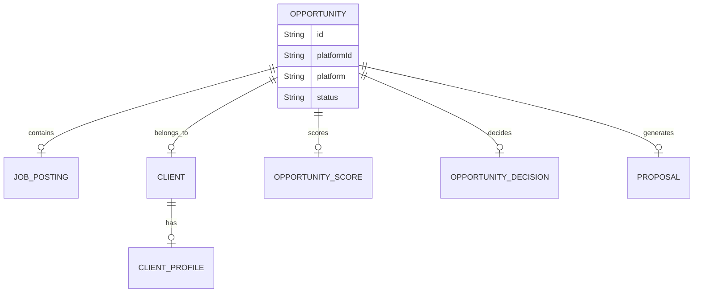
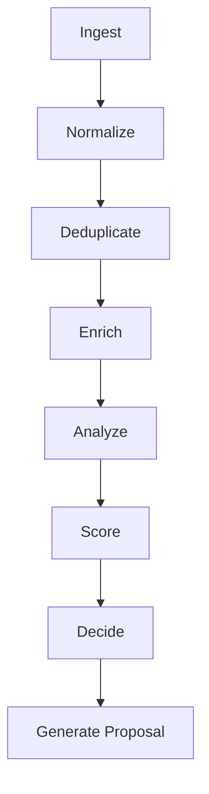
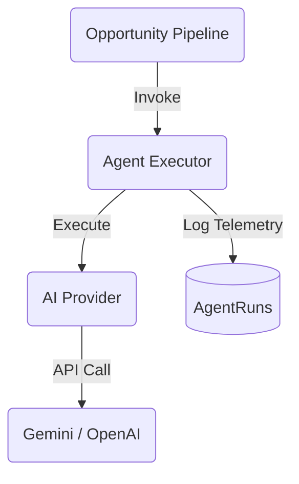

# Architecture

## Domain Model
We have implemented a strict domain model to represent opportunities, pipeline runs, and AI telemetry, moving away from simple CRUD tables.

## Pipeline Architecture
The system uses a state machine represented by `PipelineRun` to manage background processing.

## AI Architecture
AI requests are abstracted through `AgentExecutor` and `AIProvider` to allow easy swapping of underlying models (Gemini, OpenAI, etc.). All prompts are versioned separately from business logic.

