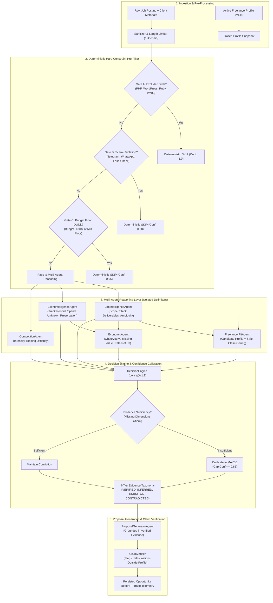
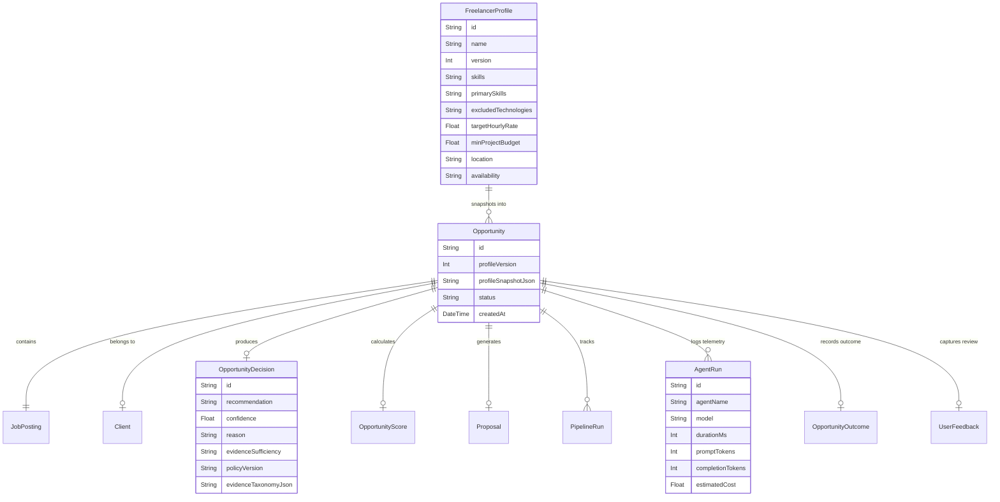

# OmniBid Technical Architecture (V1.1)

**Version:** 1.1  
**Status:** Production Hardened  
**Core Thesis:** *"LLMs reason; deterministic systems enforce constraints."*

> [!NOTE]
> ### In Plain English: How the System Works
> OmniBid processes freelance jobs in 5 straightforward stages:
> 1. **Take a Photo of your Profile**: It saves a frozen copy of your skills and minimum rates so future edits don't corrupt past records.
> 2. **Check Hard Dealbreakers First**: Before touching the AI, standard code checks if the job requires banned tech (PHP, WordPress), is a scam (Telegram), or offers an insulting budget ($30). If yes, it skips immediately.
> 3. **Specialized AI Agents Reason**: Multiple AI agents examine the job scope, client track record, and economics in parallel inside protected security tags.
> 4. **Check for Missing Facts (Calibration)**: If critical facts (like the budget) are missing, the system downgrades the decision to `MAYBE` instead of guessing.
> 5. **Write Proposal & Verify Claims**: If the job is an `APPLY`, it drafts a proposal and double-checks that the AI didn't invent any fake experience.

---

## 1. System Overview

OmniBid is an AI-powered Opportunity Decision Intelligence Engine designed for high-performing software freelancers. It automates the multi-dimensional evaluation of inbound freelance job opportunities, producing calibrated triage recommendations (`APPLY`, `MAYBE`, `SKIP`), factor-by-factor risk assessments, preserved unknown variables, and hallucination-free proposals.

---

## 2. Core Architectural Components

### 2.1 Ingestion & Profile Snapshotting
Freelancer preferences and skills are not static—they evolve over time. To ensure reproducibility:
- Every `FreelancerProfile` has a monotonically increasing `version` number.
- When an opportunity enters the pipeline, `OpportunityPipeline.ts` creates an immutable JSON snapshot of the active profile (`Opportunity.profileSnapshotJson`) and tags the opportunity with `Opportunity.profileVersion`.
- If the freelancer later modifies their profile or excluded technologies, past historical evaluations remain strictly faithful to the exact conditions present when the decision was made.

### 2.2 Deterministic Hard Constraint Pre-Filter
Large Language Models are probabilistic by nature and susceptible to prompt injection, instruction evasion, or subtle hallucinations. OmniBid eliminates critical failure modes by executing hard business constraints in deterministic TypeScript code before and in strict precedence over LLM inference:
1. **Excluded Technologies Gate:** Any presence of technologies in `profile.excludedTechnologies` triggers an immediate `SKIP` (`confidence: 1.0`).
2. **Scam & Policy Violation Gate:** Triggers an immediate `SKIP` (`confidence: 0.98`) if off-platform communication (Telegram, WhatsApp), fake check deposits, or unpaid demo work is requested.
3. **Severe Budget Deficit Gate:** If a fixed budget is < 30% of the freelancer's minimum project budget, it triggers an immediate `SKIP` (`confidence: 0.95`).

### 2.3 Delimited Multi-Agent Intelligence Layer
External job postings are untrusted user input. All agents enclose external content in boundary tags:
- `<untrusted_job_posting>...</untrusted_job_posting>`
- `<untrusted_client_data>...</untrusted_client_data>`

Each agent operates on a strongly-typed Zod schema, ensuring parse guarantees:
- **`JobIntelligenceAgent`**: Analyzes actual deliverables, core stack, hidden requirements, and ambiguity.
- **`ClientIntelligenceAgent`**: Evaluates client credibility. Crucially, when client data is missing (e.g. raw text paste), it sets `quality: 'UNKNOWN'` without fabricating scam warnings.
- **`FreelancerFitAgent`**: Compares extracted job requirements strictly against the profile. Profile facts serve as an inviolable ceiling.
- **`EconomicAgent`**: Calculates effective hourly rate, effort risk, and opportunity cost.

### 2.4 Confidence Calibration & 4-Tier Evidence Taxonomy
Raw model confidences are calibrated using deterministic missing-dimension rules:
- Uncertainty is scored based on missing budget, unverified client, and high scope ambiguity.
- If 2 or more uncertainty dimensions exist, evidence is designated `INSUFFICIENT`.
- Any raw `APPLY` decision under `INSUFFICIENT` evidence is automatically downgraded to `MAYBE` and confidence is capped at `0.65`.
- Every decision produces a structured 4-tier evidence breakdown:
  - **`VERIFIED`**: Grounded in profile skills and portfolio.
  - **`INFERRED`**: Architectural requirements derived from scope.
  - **`UNKNOWN`**: Omitted or unverified client variables.
  - **`CONTRADICTED`**: Explicitly missing skills.

### 2.5 Claim Verification & Anti-Hallucination
The `ClaimVerifier` audits generated proposals against the freelancer's profile facts. If a proposal claims experience with a technology or domain not present in the profile, the claim is flagged as hallucinated, ensuring no false claims are submitted to prospective clients.

---

## 3. Data Model & Entity Relationships

---

## 4. Observability & Telemetry Instrumentation

Every step of pipeline execution is metered and stored in SQLite:
- **`PipelineRun`**: Captures state transitions, stage execution timestamps, and failure stack traces.
- **`AgentRun`**: Records provider (`openai`), model (`gpt-4o-mini`), schema version, prompt version, retry count, prompt tokens, completion tokens, latency (`durationMs`), and estimated inference cost in USD.
- **Trace UI**: Renders real-time telemetry metrics and 4-tier evidence breakdowns directly at `/dashboard/traces/[id]`.
